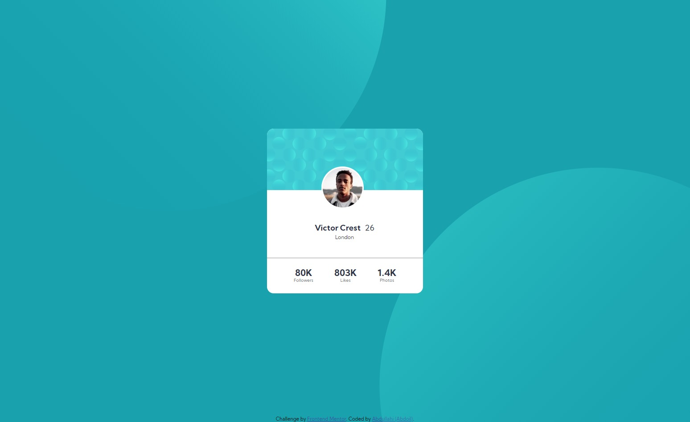

# Frontend Mentor - Profile card component solution

This is a solution to the [Profile card component challenge on Frontend Mentor](https://www.frontendmentor.io/challenges/profile-card-component-cfArpWshJ).

## Overview

### Screenshot

## Welcome! 👋

Thanks for checking out this front-end coding challenge.

## The challenge

- My challenge is to build out this profile card component and get it looking as close to the design as possible.

### Links

- Solution URL: [Frontend Mentor](https://your-solution-url.com)
- Live Site URL: [Netlify](https://profilecardcomp-abdoil.netlify.app/)

## My process

### Built with

- Semantic HTML5 markup
- CSS custom properties
- Flexbox

## Author

- Website - [Abdoil](https://www.abdoil.com)
- Frontend Mentor - [@abdoil](https://www.frontendmentor.io/profile/abdoil)
